# Sistem Informasi Pemilihan Mahasiswa

Sistem Informasi Pemilihan Mahasiswa adalah aplikasi berbasis web yang dirancang untuk mendukung proses pemilihan Ketua dan Wakil Ketua organisasi mahasiswa di lingkungan **Fakultas Ilmu Komputer**.

Sistem menangani proses pemilihan mulai dari pendataan mahasiswa dan pemilih, pendaftaran bakal calon, verifikasi administrasi, penetapan calon, pelaksanaan voting, penghitungan suara, publikasi hasil, hingga audit aktivitas sistem.

Sistem dirancang dengan memperhatikan:

- integritas pemilihan;
- kerahasiaan suara;
- pencegahan voting ganda;
- validitas pemilih;
- validitas bakal calon;
- keamanan aplikasi;
- transparansi proses;
- auditability;
- maintainability;
- usability;
- kolaborasi pengembangan melalui Git dan GitHub.

---

# Daftar Isi

1. [Tujuan Sistem](#1-tujuan-sistem)
2. [Alur Utama Sistem](#2-alur-utama-sistem)
3. [Spesifikasi Teknologi](#3-spesifikasi-teknologi)
4. [Jenis Pengguna](#4-jenis-pengguna)
5. [Modul dan Fitur](#5-modul-dan-fitur)
6. [Authentication Google](#6-authentication-google)
7. [Master Data Mahasiswa](#7-master-data-mahasiswa)
8. [Daftar Pemilih](#8-daftar-pemilih)
9. [Pengecekan Status Pemilih](#9-pengecekan-status-pemilih)
10. [Election Management](#10-election-management)
11. [Pendaftaran Bakal Calon](#11-pendaftaran-bakal-calon)
12. [Persyaratan Bakal Calon](#12-persyaratan-bakal-calon)
13. [Verifikasi Bakal Calon](#13-verifikasi-bakal-calon)
14. [Penetapan Calon](#14-penetapan-calon)
15. [Publikasi Kandidat](#15-publikasi-kandidat)
16. [Voting](#16-voting)
17. [Kerahasiaan Suara](#17-kerahasiaan-suara)
18. [Pencegahan Voting Ganda](#18-pencegahan-voting-ganda)
19. [Hasil Pemilihan](#19-hasil-pemilihan)
20. [Audit Log](#20-audit-log)
21. [Struktur Database](#21-struktur-database)
22. [Keamanan](#22-keamanan)
23. [Routing](#23-routing)
24. [Struktur Project](#24-struktur-project)
25. [Instalasi](#25-instalasi)
26. [Environment](#26-environment)
27. [Testing](#27-testing)
28. [Workflow Pengembangan Tim](#28-workflow-pengembangan-tim)
29. [Branch Strategy](#29-branch-strategy)
30. [GitHub Issues](#30-github-issues)
31. [Pull Request](#31-pull-request)
32. [Code Review](#32-code-review)
33. [Definition of Done](#33-definition-of-done)
34. [Roadmap Pengembangan](#34-roadmap-pengembangan)
35. [Status Project](#35-status-project)

---

# 1. Tujuan Sistem

Tujuan utama sistem adalah mendigitalisasi dan menata proses pemilihan mahasiswa agar:

- data pemilih dapat diverifikasi;
- pendaftaran bakal calon dapat dilakukan secara terstruktur;
- persyaratan calon dapat divalidasi;
- proses verifikasi dapat diaudit;
- pemberian suara dilakukan secara aman;
- satu pemilih hanya dapat memberikan satu suara;
- pilihan pemilih tetap rahasia;
- hasil pemilihan dapat dihitung secara otomatis;
- pengembangan aplikasi dapat dilakukan secara kolaboratif.

---

# 2. Alur Utama Sistem

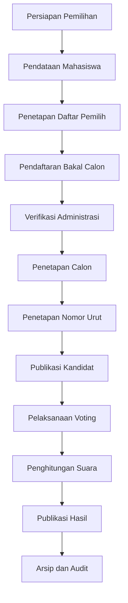

---

# 3. Spesifikasi Teknologi

## Backend

- Laravel
- PHP
- Laravel Form Request
- Laravel Policy
- Laravel Gate
- Laravel Middleware
- Laravel Socialite
- Service / Action Class jika diperlukan

## Frontend

- Blade
- Tailwind CSS
- Alpine.js
- Vite

## Database

- MySQL
- atau MariaDB

## Authentication

- Google OAuth 2.0
- Laravel Socialite

## Development Tools

- Composer
- NPM
- Git
- GitHub

## Testing

- PHPUnit
- atau Pest sesuai konfigurasi project

## Timezone

```text
Asia/Makassar
```

---

# 4. Jenis Pengguna

## 4.1 Super Admin

Super Admin memiliki hak akses tertinggi.

Fitur:

- mengelola administrator;
- mengelola role dan permission;
- mengelola konfigurasi sistem;
- mengelola election;
- melihat audit log;
- mengakses seluruh modul administratif sesuai kewenangan.

---

## 4.2 Admin / Panitia Pemilihan

Admin atau panitia dapat:

- mengelola mahasiswa;
- import mahasiswa;
- mengelola daftar pemilih;
- import daftar pemilih;
- membuat periode pemilihan;
- mengatur persyaratan bakal calon;
- memverifikasi bakal calon;
- meminta revisi;
- menolak pendaftaran;
- memverifikasi pendaftaran;
- menetapkan calon;
- menentukan nomor urut;
- memonitor partisipasi pemilih;
- mengelola publikasi hasil;
- melihat audit log.

Admin **tidak boleh mengetahui siapa memilih kandidat tertentu**.

---

## 4.3 Mahasiswa

Mahasiswa dapat:

- login menggunakan Google;
- melihat profil;
- mengecek status sebagai pemilih;
- melihat daftar kandidat;
- mendaftar sebagai bakal calon;
- menyimpan draft pendaftaran;
- upload dokumen;
- submit pendaftaran;
- melihat status verifikasi;
- memperbaiki dokumen;
- mengirim ulang pendaftaran;
- melakukan voting jika memenuhi syarat;
- melihat status bahwa suara telah diberikan.

---

# 5. Modul dan Fitur

Modul utama aplikasi:

| Modul | Fungsi |
|---|---|
| Authentication | Login menggunakan Google |
| Student Management | Master data mahasiswa |
| Student Import | Import CSV/XLSX |
| Voter Management | Mengelola daftar pemilih |
| Voter Verification | Pengecekan status pemilih |
| Election Management | Mengelola periode pemilihan |
| Candidate Requirements | Mengatur persyaratan bakal calon |
| Candidate Registration | Form pendaftaran bakal calon |
| Document Management | Upload dokumen persyaratan |
| Candidate Verification | Verifikasi oleh panitia |
| Candidate Establishment | Penetapan calon resmi |
| Candidate Profile | Publikasi calon |
| Voting | Proses pemberian suara |
| Voting Monitor | Monitoring tingkat partisipasi |
| Result | Penghitungan dan publikasi hasil |
| Audit Log | Pencatatan aktivitas |
| Settings | Konfigurasi aplikasi |

---

# 6. Authentication Google

Mahasiswa melakukan login menggunakan akun Google.

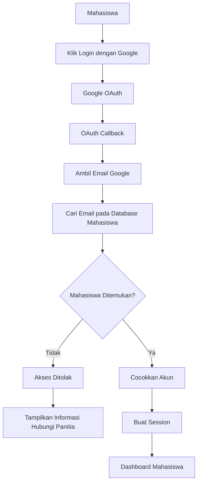

Keberhasilan login Google **tidak otomatis** menjadikan mahasiswa sebagai pemilih.

---

# 7. Master Data Mahasiswa

Data mahasiswa disimpan pada tabel:

```text
students
```

Field utama:

- `id`
- `nim`
- `name`
- `email`
- `study_program`
- `class_year`
- `semester`
- `student_status`
- `google_id`
- `phone`
- `created_at`
- `updated_at`

Constraint:

```text
nim   UNIQUE
email UNIQUE
```

Status mahasiswa:

```text
active
inactive
graduated
suspended
```

---

# 8. Daftar Pemilih

Status mahasiswa sebagai pemilih dipisahkan dari master mahasiswa.

Tabel:

```text
voters
```

Field utama:

- `id`
- `election_id`
- `student_id`
- `voter_status`
- `verified_at`
- `verified_by`
- `notes`
- `created_at`
- `updated_at`

Status:

```text
eligible
not_eligible
suspended
```

Constraint:

```text
UNIQUE(election_id, student_id)
```

Dengan demikian, status pemilih selalu terkait dengan periode pemilihan tertentu.

---

# 9. Pengecekan Status Pemilih

Halaman:

```text
/cek-pemilih
```

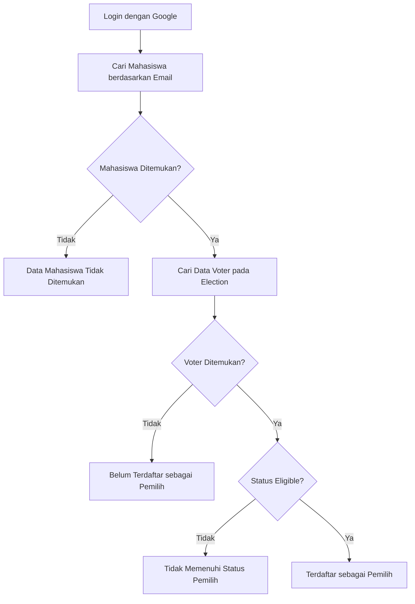

Jika terdaftar, tampilkan:

- Nama
- NIM
- Email
- Program Studi
- Angkatan
- Semester
- Status Pemilih

---

# 10. Election Management

Tabel:

```text
elections
```

Field utama:

- `id`
- `name`
- `slug`
- `description`
- `registration_start`
- `registration_end`
- `verification_start`
- `verification_end`
- `candidate_finalization_at`
- `campaign_start`
- `campaign_end`
- `voting_start`
- `voting_end`
- `result_publish_at`
- `status`
- `created_by`

Status:

```text
draft
registration
verification
candidate_finalization
upcoming
voting
closed
published
archived
```

Semua validasi periode harus dilakukan pada backend.

---

# 11. Pendaftaran Bakal Calon

Pendaftaran bakal calon dilakukan menggunakan form multi-step.

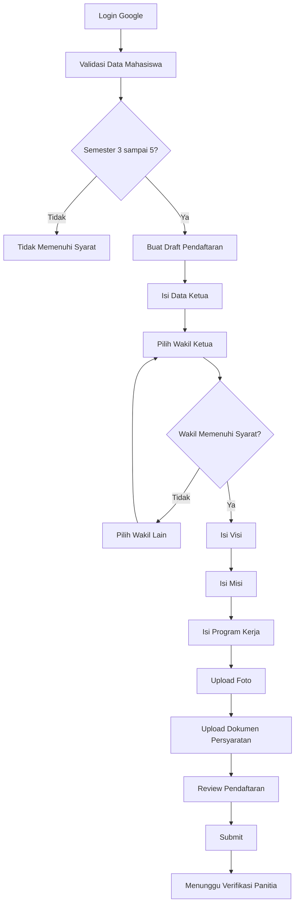

---

# 12. Persyaratan Bakal Calon

Ketua dan Wakil wajib:

- mahasiswa aktif;
- terdaftar pada database Fakultas Ilmu Komputer;
- minimal semester **3**;
- maksimal semester **5**;
- tidak berstatus suspended;
- tidak terdaftar pada pasangan lain dalam election yang sama;
- Ketua dan Wakil tidak boleh merupakan mahasiswa yang sama;
- periode pendaftaran masih aktif;
- memenuhi dokumen persyaratan yang ditentukan panitia.

Validasi semester:

```text
semester >= 3 AND semester <= 5
```

Semester valid:

```text
3
4
5
```

Semester tidak valid:

```text
1
2
6
7
8
dan seterusnya
```

Semester harus berasal dari database, bukan input frontend.

---

# 13. Verifikasi Bakal Calon

Status pendaftaran:

```text
draft
submitted
under_review
revision_required
resubmitted
verified
rejected
established
```

Alur verifikasi:

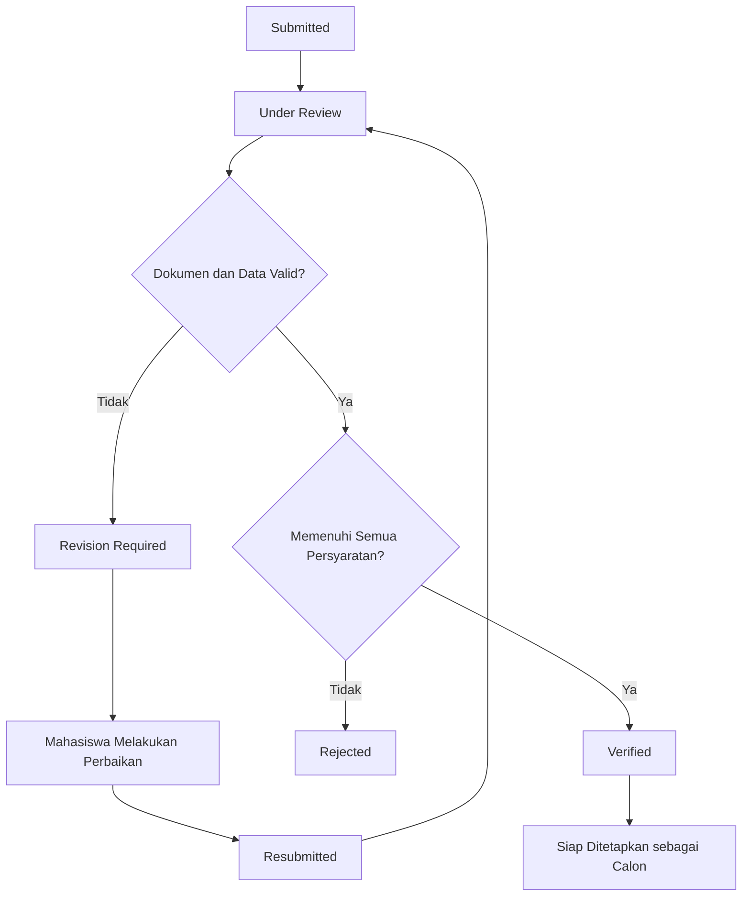

Panitia dapat melakukan verifikasi per dokumen.

Status dokumen:

```text
pending
valid
invalid
revision_required
```

---

# 14. Penetapan Calon

Hanya bakal calon berstatus:

```text
verified
```

yang dapat ditetapkan menjadi calon resmi.

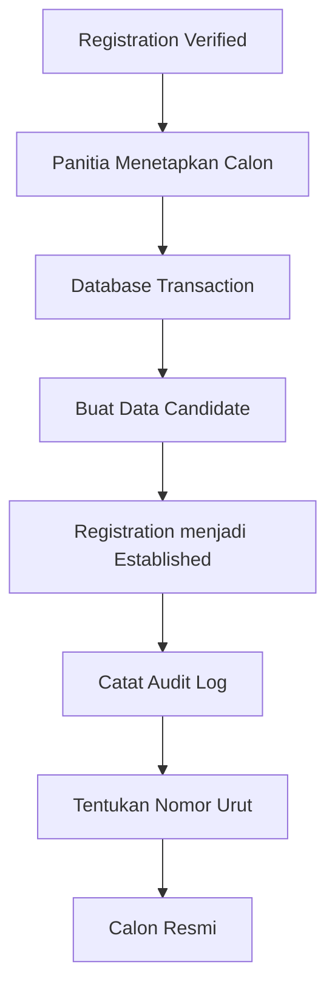

Nomor urut harus unik dalam satu election.

```text
UNIQUE(election_id, candidate_number)
```

---

# 15. Publikasi Kandidat

Halaman:

```text
/kandidat
```

Data yang ditampilkan:

- nomor urut;
- foto;
- nama Ketua;
- nama Wakil;
- program studi;
- visi;
- misi;
- program kerja.

Urutan:

```text
candidate_number ASC
```

Tampilan harus netral dan tidak memberikan rekomendasi atau ranking.

---

# 16. Voting

Mahasiswa hanya dapat melakukan voting jika:

1. sudah login;
2. terdaftar sebagai mahasiswa;
3. terdaftar pada daftar pemilih;
4. status `eligible`;
5. periode voting sedang aktif;
6. belum pernah memilih;
7. kandidat yang dipilih aktif pada election tersebut.

Alur voting:

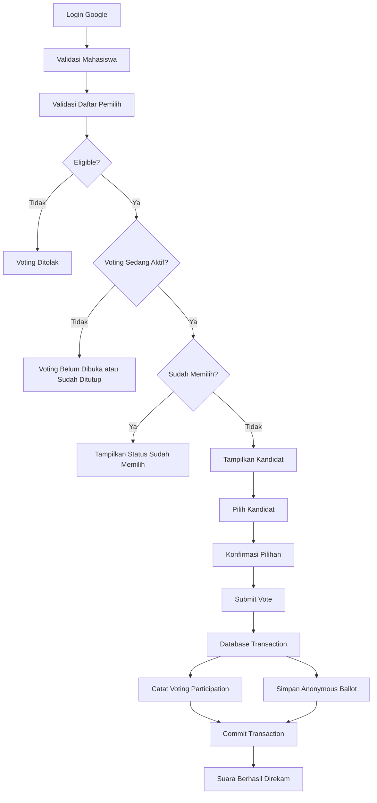

---

# 17. Kerahasiaan Suara

Identitas pemilih harus dipisahkan dari isi suara.

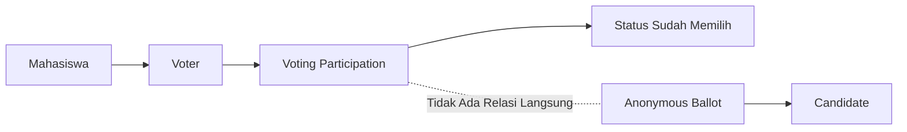

## Voting Participation

Tabel:

```text
voting_participations
```

Menyimpan:

- `election_id`
- `voter_id`
- `voted_at`

Tujuan:

> mengetahui bahwa pemilih sudah menggunakan hak pilih.

---

## Anonymous Ballot

Tabel:

```text
ballots
```

Menyimpan:

- `election_id`
- `candidate_id`
- `ballot_uuid`
- `integrity_hash`
- `submitted_at`

Ballot **tidak boleh** menyimpan:

```text
voter_id
student_id
nim
email
google_id
```

---

# 18. Pencegahan Voting Ganda

Constraint utama:

```text
UNIQUE(election_id, voter_id)
```

Perlindungan:

- database transaction;
- unique constraint;
- server-side validation;
- CSRF;
- row locking jika diperlukan;
- idempotency jika diperlukan.

Sistem harus aman terhadap:

- double click;
- browser refresh;
- multiple tabs;
- duplicate POST;
- replay request;
- concurrent request;
- race condition.

---

# 19. Hasil Pemilihan

Hasil dihitung dari:

```text
ballots
```

Bukan dari:

```text
voting_participations
```

Data hasil:

- suara per kandidat;
- total suara sah;
- total pemilih;
- jumlah sudah memilih;
- jumlah belum memilih;
- tingkat partisipasi;
- persentase kandidat.

Persentase kandidat:

```text
jumlah_suara_kandidat / total_suara_sah * 100
```

Partisipasi:

```text
jumlah_sudah_memilih / total_pemilih * 100
```

Alur publikasi:

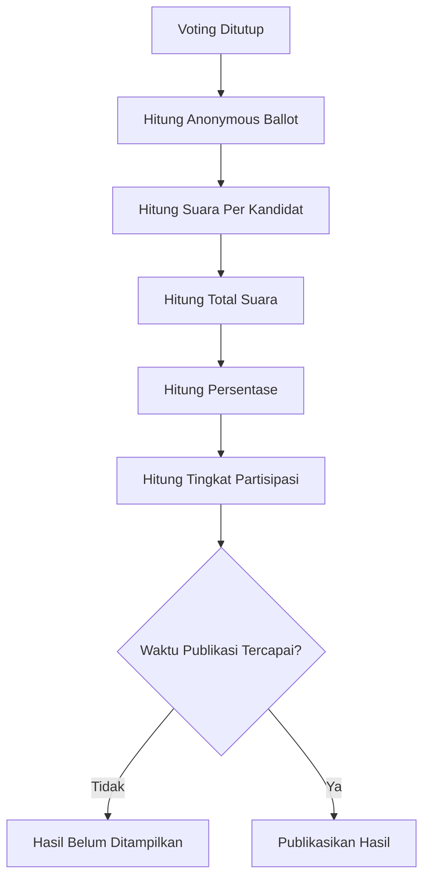

---

# 20. Audit Log

Tabel:

```text
audit_logs
```

Aktivitas yang dicatat:

- login administrator;
- import mahasiswa;
- perubahan mahasiswa;
- import voter;
- perubahan voter;
- pembuatan election;
- perubahan jadwal;
- perubahan requirements;
- submit registration;
- request revision;
- resubmit;
- verify;
- reject;
- establish candidate;
- penetapan nomor urut;
- publikasi hasil;
- perubahan setting.

Audit log **tidak boleh menyimpan pilihan pemilih**.

---

# 21. Struktur Database

Tabel utama:

```text
users
students
elections
voters
candidate_requirements
candidate_registrations
candidate_registration_documents
candidate_registration_histories
candidate_programs
candidates
voting_participations
ballots
audit_logs
system_settings
```

Relasi konseptual:

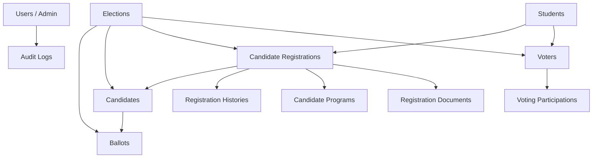

---

# 22. Keamanan

Sistem harus melindungi terhadap:

- SQL Injection;
- XSS;
- CSRF;
- IDOR;
- Mass Assignment;
- Privilege Escalation;
- Session Hijacking;
- Session Fixation;
- Brute Force;
- Replay Request;
- Race Condition;
- Duplicate Vote;
- File Upload Attack;
- MIME Spoofing;
- Unauthorized Direct Object Access;
- Unauthorized API Access.

Gunakan:

- Middleware
- Policy
- Gate
- Laravel Form Request
- CSRF Protection
- Database Constraint
- Database Transaction
- Authorization
- Validation
- Rate Limiting

---

# 23. Routing

## Public

```text
/
/cek-pemilih
/kandidat
/kandidat/{candidate}
/hasil/{election}
```

## Authentication

```text
/login
/login/google
/auth/google/callback
/logout
```

## Mahasiswa

```text
/dashboard
/profil
```

## Bakal Calon

```text
/pendaftaran-bakal-calon
/pendaftaran-bakal-calon/create
/pendaftaran-bakal-calon/{registration}
/pendaftaran-bakal-calon/{registration}/edit
/pendaftaran-bakal-calon/{registration}/dokumen
/pendaftaran-bakal-calon/{registration}/review
/pendaftaran-bakal-calon/{registration}/submit
/pendaftaran-bakal-calon/{registration}/resubmit
```

## Voting

```text
/pemilihan
/pemilihan/{election}
/vote/{election}
/vote/{election}/confirm
/vote/{election}/submit
/vote/{election}/success
```

## Admin

```text
/admin/dashboard
/admin/mahasiswa
/admin/mahasiswa/import
/admin/pemilih
/admin/pemilih/import
/admin/elections
/admin/requirements
/admin/pendaftaran-bakal-calon
/admin/kandidat
/admin/voting-monitor
/admin/hasil
/admin/audit-log
/admin/settings
```

---

# 24. Struktur Project

Struktur Laravel secara umum:

```text
app/
├── Actions/
├── Http/
│   ├── Controllers/
│   ├── Middleware/
│   └── Requests/
├── Models/
├── Policies/
└── Services/

database/
├── factories/
├── migrations/
└── seeders/

resources/
├── css/
├── js/
└── views/

routes/
├── web.php
└── console.php

tests/
├── Feature/
└── Unit/

docs/
├── architecture.md
├── erd.md
├── authentication-flow.md
├── candidate-registration-flow.md
├── voting-flow.md
└── security.md
```

Struktur aktual dapat disesuaikan dengan repository existing.

---

# 25. Instalasi

Clone repository:

```bash
git clone <repository-url>
```

Masuk ke project:

```bash
cd sistem-pemilihan-mahasiswa
```

Install dependency PHP:

```bash
composer install
```

Install dependency frontend:

```bash
npm install
```

Copy environment:

```bash
cp .env.example .env
```

Untuk Windows PowerShell:

```powershell
Copy-Item .env.example .env
```

Generate application key:

```bash
php artisan key:generate
```

Konfigurasi database pada `.env`.

Jalankan migration:

```bash
php artisan migrate
```

Jika tersedia seeder:

```bash
php artisan db:seed
```

atau:

```bash
php artisan migrate --seed
```

Jalankan frontend:

```bash
npm run dev
```

Jalankan Laravel:

```bash
php artisan serve
```

---

# 26. Environment

Contoh `.env.example`:

```env
APP_NAME="Sistem Pemilihan Mahasiswa"
APP_ENV=local
APP_KEY=
APP_DEBUG=true
APP_URL=http://localhost

APP_TIMEZONE=Asia/Makassar

DB_CONNECTION=mysql
DB_HOST=127.0.0.1
DB_PORT=3306
DB_DATABASE=pemilihan_mahasiswa
DB_USERNAME=
DB_PASSWORD=

GOOGLE_CLIENT_ID=
GOOGLE_CLIENT_SECRET=
GOOGLE_REDIRECT_URI=http://localhost/auth/google/callback
```

File berikut **tidak boleh masuk GitHub**:

```text
.env
```

Pastikan `.gitignore` mencakup:

```gitignore
/vendor
/node_modules
/public/build
/public/hot
/storage/*.key
.env
.env.backup
.env.production
.phpunit.result.cache
/.idea
/.vscode
```

---

# 27. Testing

Jalankan:

```bash
php artisan test
```

Jika menggunakan Laravel Pint:

```bash
./vendor/bin/pint
```

## Test Authentication

- Google email terdaftar;
- Google email tidak terdaftar;
- inactive student;
- unauthorized access.

## Test Bakal Calon

Valid semester:

```text
3
4
5
```

Tidak valid:

```text
1
2
6
7
8
```

Test lain:

- Ketua = Wakil;
- pasangan sudah terdaftar;
- dokumen tidak lengkap;
- save draft;
- submit;
- revision;
- resubmit;
- verify;
- reject;
- establish.

## Test Voting

- eligible voter;
- non-eligible voter;
- voting sebelum dibuka;
- voting sedang aktif;
- voting setelah ditutup;
- duplicate vote;
- double submit;
- concurrent request;
- candidate dari election lain;
- inactive candidate.

## Test Privacy

Pastikan ballot tidak memiliki:

```text
voter_id
student_id
nim
email
google_id
```

---

# 28. Workflow Pengembangan Tim

Setiap developer bekerja menggunakan branch fitur.

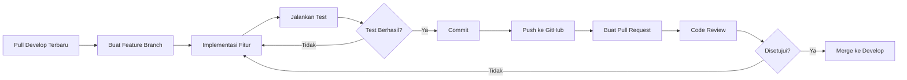

---

# 29. Branch Strategy

Struktur branch:

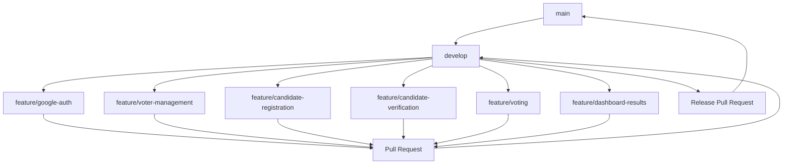

## `main`

Berisi versi stabil.

## `develop`

Branch integrasi development.

## `feature/*`

Branch pengembangan fitur.

Contoh:

```text
feature/google-auth
feature/voter-management
feature/candidate-registration
feature/candidate-verification
feature/voting
feature/dashboard-results
```

---

# 30. GitHub Issues

Gunakan GitHub Issues untuk membagi pekerjaan.

Contoh:

```text
#1 Setup Project
#2 Google Authentication
#3 Student Management
#4 Voter Management
#5 Voter Verification
#6 Election Management
#7 Candidate Requirements
#8 Candidate Registration
#9 Candidate Verification
#10 Candidate Management
#11 Voting Module
#12 Result Calculation
#13 Audit Log
#14 Security Review
#15 Automated Testing
```

Branch dapat menggunakan nomor issue:

```text
feature/8-candidate-registration
feature/11-voting
```

---

# 31. Pull Request

Setiap Pull Request minimal menjelaskan:

## Deskripsi

Apa yang dibuat.

## Changes

File atau modul utama yang berubah.

## Database

Migration yang dibuat.

## Testing

Test yang telah dilakukan.

## Security

Dampak keamanan fitur.

## Screenshot

Sertakan jika terdapat perubahan UI.

Contoh judul:

```text
feat: implement candidate registration
```

---

# 32. Code Review

Reviewer memeriksa:

- requirement;
- coding convention;
- authorization;
- validation;
- keamanan;
- database integrity;
- test;
- duplicate logic;
- UI consistency;
- migration.

Untuk voting, review wajib memperhatikan:

- anonymous ballot;
- duplicate vote;
- transaction;
- race condition;
- authorization;
- privacy.

---

# 33. Definition of Done

Fitur dianggap selesai jika:

- requirement terpenuhi;
- code berjalan;
- server-side validation tersedia;
- authorization tersedia;
- migration aman;
- automated test tersedia jika relevan;
- seluruh test terkait berhasil;
- tidak membocorkan informasi sensitif;
- dokumentasi diperbarui;
- Pull Request sudah direview;
- sudah merge ke `develop`.

---

# 34. Roadmap Pengembangan

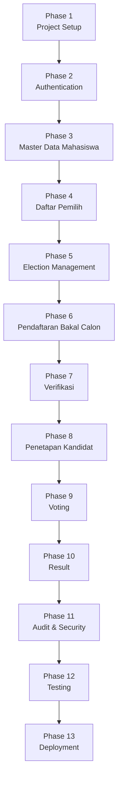

## Phase 1 — Project Setup

- setup Laravel;
- database;
- environment;
- Git;
- GitHub;
- base UI.

## Phase 2 — Authentication

- Google OAuth;
- session;
- role;
- middleware;
- authorization.

## Phase 3 — Master Data Mahasiswa

- students;
- CRUD;
- import.

## Phase 4 — Daftar Pemilih

- voters;
- import;
- cek status pemilih.

## Phase 5 — Election

- periode;
- jadwal;
- status.

## Phase 6 — Pendaftaran Bakal Calon

- eligibility;
- semester 3–5;
- draft;
- multi-step form;
- upload;
- submit.

## Phase 7 — Verifikasi

- review;
- revision;
- resubmit;
- verify;
- reject.

## Phase 8 — Kandidat

- establishment;
- nomor urut;
- profil kandidat.

## Phase 9 — Voting

- eligibility;
- anonymous ballot;
- participation;
- transaction;
- duplicate protection.

## Phase 10 — Result

- vote count;
- percentage;
- turnout;
- publication.

## Phase 11 — Audit & Security

- audit log;
- authorization review;
- privacy review;
- vulnerability review.

## Phase 12 — Testing

- feature test;
- integration test;
- concurrency-oriented test;
- final regression.

## Phase 13 — Deployment

- production configuration;
- database;
- environment;
- HTTPS;
- backup;
- monitoring.

---

# 35. Status Project

Gunakan checklist berikut untuk memonitor progress:

```text
[ ] Project Setup
[ ] Git & GitHub Setup
[ ] Base UI
[ ] Google Authentication
[ ] Role & Permission
[ ] Student Management
[ ] Student Import
[ ] Voter Management
[ ] Voter Import
[ ] Voter Verification
[ ] Election Management
[ ] Candidate Requirements
[ ] Candidate Registration
[ ] Candidate Eligibility Semester 3-5
[ ] Candidate Document Upload
[ ] Candidate Verification
[ ] Candidate Revision
[ ] Candidate Resubmission
[ ] Candidate Rejection
[ ] Candidate Establishment
[ ] Candidate Number
[ ] Candidate Public Profile
[ ] Voting
[ ] Anonymous Ballot
[ ] Voting Participation
[ ] Duplicate Vote Protection
[ ] Voting Monitor
[ ] Result Calculation
[ ] Result Publication
[ ] Audit Log
[ ] Security Review
[ ] Automated Testing
[ ] Documentation
[ ] Deployment
```

---

# 36. Prioritas Sistem

Urutan prioritas pengembangan:

```text
1. Integritas Pemilihan
2. Kerahasiaan Suara
3. Pencegahan Voting Ganda
4. Validitas Pemilih
5. Validitas Bakal Calon
6. Authorization
7. Auditability
8. Security
9. Correctness
10. Maintainability
11. Usability
12. Visual Design
```

---

# 37. Aturan Penting untuk Developer

Developer tidak diperbolehkan:

- commit file `.env`;
- commit password database;
- commit `GOOGLE_CLIENT_SECRET`;
- menyimpan OAuth token pada source code;
- membuat `ballots.voter_id`;
- menyimpan pilihan kandidat pada tabel voter;
- membuat candidate sebelum registration verified;
- mempercayai semester dari frontend;
- menghapus audit history tanpa alasan;
- bypass authorization;
- mengubah hasil voting secara manual;
- push langsung ke `main`;
- merge fitur kritis tanpa review;
- mengubah automated test hanya agar implementasi yang salah menjadi pass.

---

# 38. Ringkasan Arsitektur Sistem

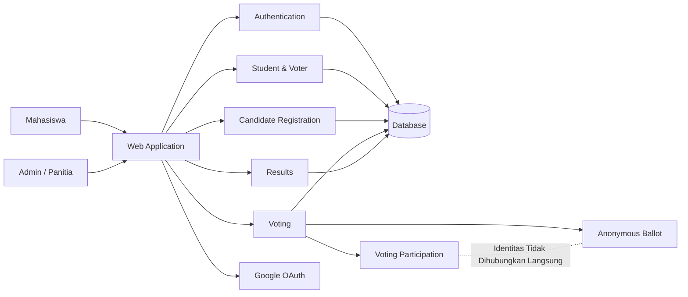

---

# 39. Kesimpulan

Sistem Informasi Pemilihan Mahasiswa dikembangkan untuk menangani proses pemilihan secara terstruktur mulai dari:

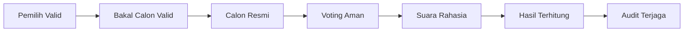