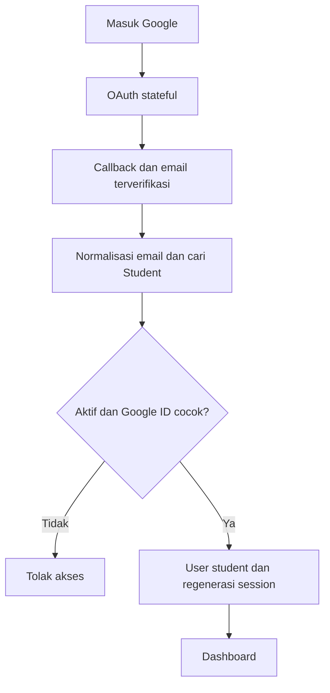
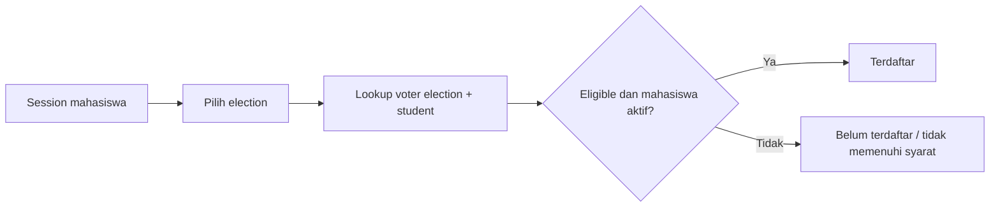
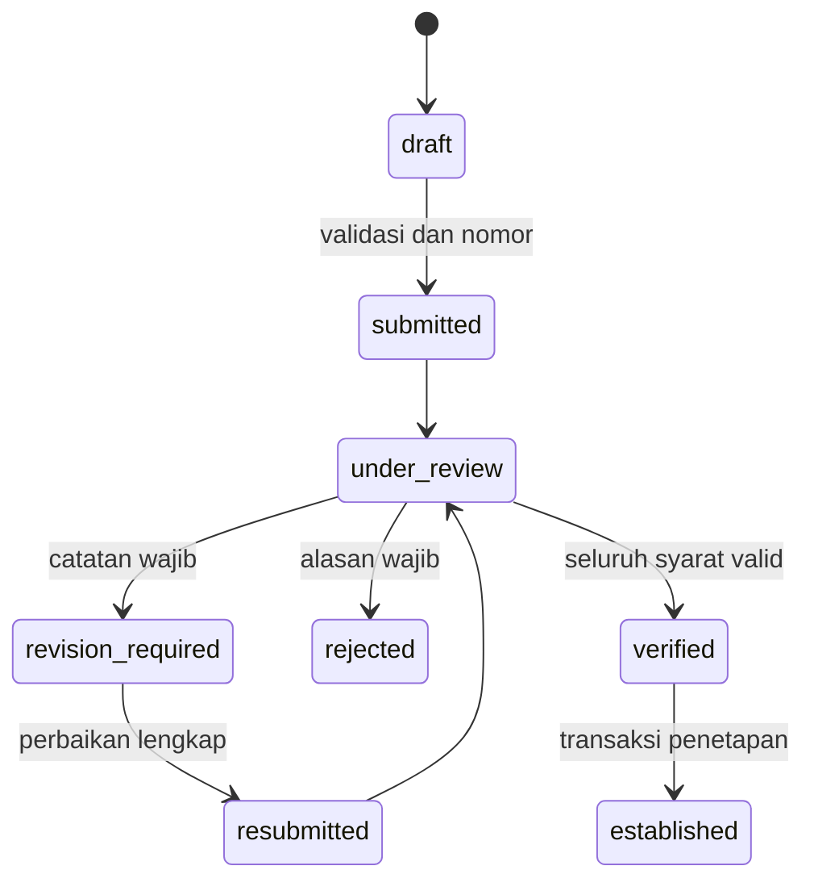
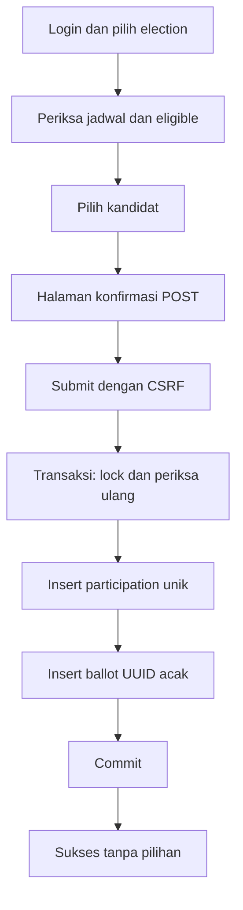

# Arsitektur SIPMA

## Aplikasi dan modul
Monolit Laravel 13 / PHP 8.4, Blade, Tailwind CSS dan Vite. Batas modul: identitas, administrasi master, pencalonan, verifikasi, pemilihan, pelaporan. Controller mengorkestrasi HTTP, Form Request memvalidasi bentuk data, Policy/Gate mengotorisasi, Action menjalankan aturan dan transaksi. Database produksi: InnoDB MySQL/MariaDB. SQLite hanya untuk test cepat.

## Auth dan authorization
Google Socialite menggunakan OAuth state dari session (bukan stateless), email terverifikasi, pencocokan email lowercase terhadap master mahasiswa aktif, dan pengikatan subject Google yang tidak boleh berubah diam-diam. Token Google tidak disimpan. Akun Google tidak pernah mendapat role admin atau voter otomatis. Admin login password, rate limiting dan session regeneration. Middleware mengecek akun aktif dan status mahasiswa pada setiap request terproteksi. Role inti: super_admin, admin, student. Permission administratif disimpan per role dan diperiksa Gate; pengelolaan administrator/role/settings hanya super admin. Policy pendaftaran mengizinkan pemilik/pasangan membaca, Ketua mengedit, panitia berpermission memeriksa. Dokumen melalui controller terotorisasi.

## Cek pemilih
Identitas dari user session; election dipilih eksplisit. Query voter berdasarkan election dan student. Tidak ada endpoint publik untuk mencari identitas mahasiswa bebas. Pencarian Wakil membutuhkan login, kecocokan NIM/email persis, dan pembatasan request.

## Database dan waktu
Seluruh jadwal dan waktu aplikasi menggunakan Asia/Makassar, koneksi MySQL +08:00. Jendela waktu menggunakan awal inklusif dan akhir eksklusif. Foreign key restrict mencegah penghapusan jejak pemilihan. Unique NIM/email, voter per election/student, anggota pasangan per election/student, nomor pendaftaran, nomor urut per election, participation per election/voter. Composite foreign key mengikat ballot/candidate dan participation/voter pada election yang sama. Jadwal, daftar pemilih, dan kandidat dibekukan saat pemungutan dimulai; persyaratan dibekukan setelah pendaftaran pertama diajukan.

## Pendaftaran dan verifikasi
Semester Ketua/Wakil selalu dibaca ulang dari master database: 3 <= semester <= 5. Keduanya aktif dan berbeda. Penguncian election dan mahasiswa, ditambah constraint anggota pasangan, mencegah race pendaftaran lintas posisi. Draft persisten, submit memvalidasi kelengkapan dan menghasilkan nomor backend. Form terkunci setelah submit. Saat revision_required, hanya dokumen yang diminta revisi boleh diganti; identitas dan isi lain terkunci. File versi lama dan status history tetap tersimpan. Seluruh dokumen wajib harus valid sebelum verification. Penetapan hanya dari verified, dalam transaksi yang juga menyimpan candidate, history, notifikasi, dan audit.

## Voting
Semua syarat dicek ulang di transaksi. Election dikunci untuk serialisasi dengan perubahan administrasi; voter dan mahasiswa diperiksa dari database. Candidate harus aktif, bernomor urut, dan election sama. Participation unik menjadi lapisan akhir anti-duplikat. Jika insert ballot gagal, participation ikut rollback. Voting POST tidak menyimpan pilihan dalam session, flash old input, notifikasi, audit, atau response sukses.

## Privacy dan batas jaminan
Participation berisi voter + waktu berpartisipasi, tanpa candidate. Ballot berisi election + candidate + UUID acak, tanpa identitas, IP, user agent, session ID, participation ID, atau token korelasi. Tidak ada relasi Eloquent ballot ke voter. Timestamp ballot memakai waktu penutupan election yang sama untuk semua suara, bukan waktu request; ini sengaja mengurangi korelasi waktu. ID ballot berupa UUID v4, bukan urutan insert. Integrity hash menggunakan HMAC tanpa identitas.

Ini adalah anonimitas pada model aplikasi, bukan protokol e-voting kriptografis. Operator yang mengendalikan database, transaction/binlog, server, atau request tracing masih dapat mengorelasikan transaksi. Produksi harus membatasi akses DBA, backup/binlog, serta menonaktifkan perekaman body pada vote, query profiling, Telescope/Debugbar dan APM yang merekam SQL/bindings. HMAC tidak melindungi terhadap operator yang menguasai kunci. Jangan menjanjikan coercion resistance, verifikasi universal, atau secret ballot terhadap host yang terkompromi.

## Hasil dan audit
Hitung suara dari ballot, participation hanya untuk turnout. Tidak ada endpoint daftar ballot individual. Hasil kandidat hanya tersedia setelah voting_end dan status published serta result_publish_at tercapai. Monitor selama voting hanya angka partisipasi. Audit administratif append-only di aplikasi, dengan whitelist perubahan yang tidak berisi password/token/pilihan. History tidak mempunyai route hapus. Perlindungan terhadap operator database memerlukan hak akses dan backup eksternal.

## Upload dan import
Dokumen PDF/JPEG/PNG: ekstensi dan MIME terpisah, batas ukuran, nama acak, storage privat, download attachment dengan nosniff. Foto JPEG/PNG divalidasi dimensi dan ditampilkan hanya bagi candidate publik. Versi dokumen disimpan. CSV/XLSX dibatasi ukuran dan jumlah baris; XLSX dibatasi ukuran uncompressed, formula tidak dievaluasi. Preview disimpan server dengan owner dan masa berlaku, confirmation hanya memakai token acak, bukan data dari hidden input. Mode default insert-only; update harus dipilih eksplisit, konflik identitas ditolak, seluruh perubahan valid di transaksi. NIM wajib diperlakukan sebagai teks.

## Route structure
Publik: `/`, `/login`, `/login/google`, `/auth/google/callback`, `/kandidat`, `/kandidat/{candidate}`, `/hasil/{election}`.
Mahasiswa: `/dashboard`, `/profil`, `/cek-pemilih`, `/pendaftaran-bakal-calon/*`, `/pemilihan`, `/vote/{election}/*`.
Panitia: `/admin/dashboard`, `/admin/mahasiswa`, `/admin/pemilih`, `/admin/elections`, `/admin/requirements`, `/admin/pendaftaran-bakal-calon`, `/admin/kandidat`, `/admin/voting-monitor`, `/admin/hasil`, `/admin/audit-log`.
Super admin: `/admin/administrators`, `/admin/roles`, `/admin/settings`.

## Strategi pengujian
Feature tests mencakup auth, permission, status pemilih, eligibility semester untuk kedua posisi, state transition, upload/IDOR, import, publikasi, constraint lintas election, duplicate vote, rollback dan privacy schema. Uji concurrency menggunakan proses independen terhadap database MySQL/MariaDB khusus pengujian. Render Blade dan build Vite diverifikasi. OAuth nyata memerlukan client Google milik penyelenggara; automated test memakai mock provider yang memeriksa klaim email dan subject.
