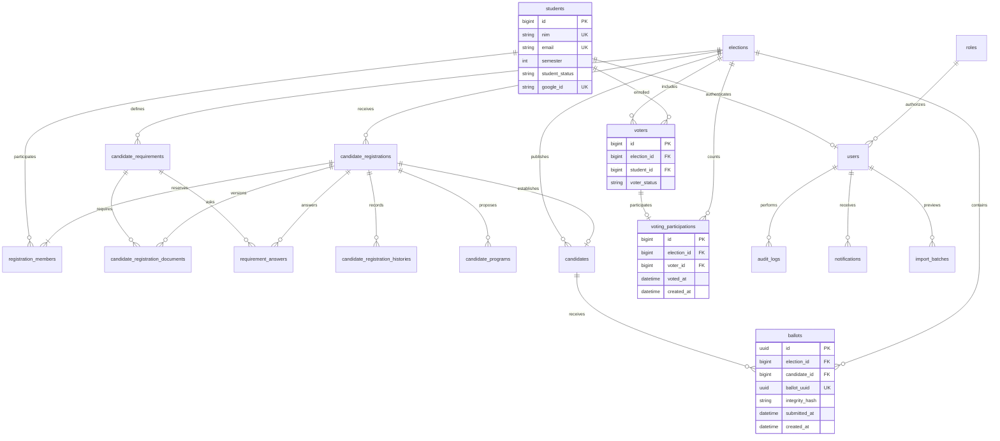

# Entity Relationship Diagram

Tidak ada hubungan ballot–voter/participation/student/user. `ballots.submitted_at` dan `created_at` memakai penutupan periode yang sama; bukan waktu aktual submit.

Constraint tambahan: voters(election_id, student_id), registration_members(election_id, student_id), candidates(election_id, candidate_number), candidates(candidate_registration_id), voting_participations(election_id, voter_id), registration_number. Composite FK memastikan election pada ballot/participation cocok dengan kandidat/voter.
